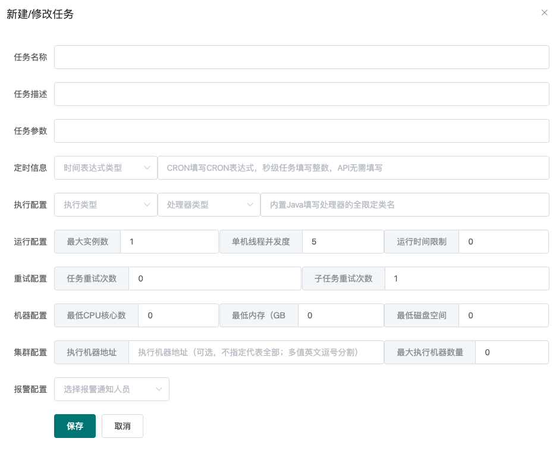
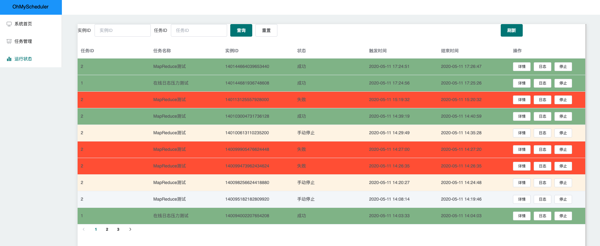

[toc]
# 任务配置
>前端界面目前可能有那么一点点丑...不过问题不是很大 (>▽<) 

### 系统首页
> 展示了系统整体的概览和集群Worker列表。


### 任务录入
>一切的起点。


* 任务名称：名称，无特殊作用
* 任务描述：描述，无特殊作用，请尽量简短（占用数据库字段空间）
* 任务参数：任务处理时能够获取到的参数（即各个Processor的process方法的TaskContext对象的jobParams字段）（进行一次处理器开发就能理解了）
* 定时信息：由下拉框和输入框组成
    * API -> 不需要填写任何参数（填了也不起作用）
    * CRON -> 填写 CRON 表达式（可以找个在线生成网站生成）
    * 固定频率 -> 填写整数，单位毫秒
    * 固定延迟 -> 填写整数，单位毫秒
* 执行配置：由执行类型（单机、广播和MapReduce）、处理器类型和处理器参数组成，后两项相互关联。
    * 内置Java处理器 -> 填写该处理器的全限定类名（eg, `com.github.kfcfans.oms.processors.demo.MapReduceProcessorDemo`）
    * SHELL -> 填写需要处理的脚本（直接复制文件内容）或脚本下载连接（http://xxx）
    * PYTHON -> 填写完整的python脚本或下载连接（http://xxx）
    
* 运行配置
    * 最大实例数：该任务同时执行的数量（任务和实例就像是类和对象的关系，任务被调度执行后被称为实例）
    * 单机线程并发数：该实例执行过程中每台机器使用的线程数量（MapReduce任务生效，其余无论填什么，实际都是1，因为用不到多个线程...）
    * 运行时间限制：限定任务的最大运行时间，超时则视为失败，单位毫秒，0代表不限制超时时间。

* 重试配置：
    * 任务重试次数：实例级别，失败了整个重试。
    * 子任务重试次数：MapReduce和广播执行模式下生效，每个子Task失败后单独重试。

* 机器配置：用来标明允许执行任务的机器状态，避开那些摇摇欲坠的机器，0代表无任何限制。
* 集群配置
    * 执行机器地址：指定集群中的某几台机器执行任务（debug的好帮手）
    * 最大执行机器数量：限定调动执行的机器数量

* 报警配置：预计由报警方式和报警人两个下拉框组成。

### 任务管理
>可以方便地查看和管理系统当前录入的任务信息。


### 运行状态
>可以方便地查看当前运行的任务实例，点击详情即可获取详细的信息，点击停止则可以强制终止该任务。




# 处理器开发
>搭载处理器的宿主应用需要添加`oh-my-scheduler-worker`依赖。

### 单机处理器
>单机执行的策略下，server会在所有可用worker中选取健康度最佳的机器进行执行。单机执行任务需要实现接口：`com.github.kfcfans.oms.worker.core.processor.sdk.BasicProcessor`，代码示例如下：

```java
public class BasicProcessorDemo implements BasicProcessor {

    @Override
    public ProcessResult process(TaskContext context) throws Exception {

        // TaskContext为任务的上下文信息，包含了在控制台录入的任务元数据，常用字段为
        // jobParams（任务参数，在控制台录入），instanceParams（任务实例参数，通过 OpenAPI 触发的任务实例才可能存在该参数）

        // 进行实际处理...

        // 返回结果，该结果会被持久化到数据库，在前端页面直接查看，极为方便
        return new ProcessResult(true, "result is xxx");
    }
    @Override
    public void init() throws Exception {
        // 初始化处理器
    }
    @Override
    public void destroy() throws Exception {
        // 释放资源，销毁处理器
    }
}
```

### 广播执行处理器
>广播执行的策略下，所有机器都会被调度执行该任务。为了便于资源的准备和释放，广播处理器在`BasicProcessor`的基础上额外增加了`preProcess`和`postProcess`方法，分别在整个集群开始之前/结束之后**选一台机器**执行相关方法。代码示例如下：

```java
public class BroadcastProcessorDemo extends BroadcastProcessor {

    @Override
    public ProcessResult preProcess(TaskContext taskContext) throws Exception {
        // 预执行，会在所有 worker 执行 process 方法前调用
        return new ProcessResult(true, "init success");
    }

    @Override
    public ProcessResult process(TaskContext context) throws Exception {
        // 撰写整个worker集群都会执行的代码逻辑
        return new ProcessResult(true, "release resource success");
    }

    @Override
    public ProcessResult postProcess(TaskContext taskContext, List<TaskResult> taskResults) throws Exception {

        // taskResults 存储了所有worker执行的结果（包括preProcess）

        // 收尾，会在所有 worker 执行完毕 process 方法后调用，该结果将作为最终的执行结果在
        return new ProcessResult(true, "process success");
    }

}
```

### MapReduce处理器
>MapReduce是最复杂也是最强大的一种执行器，它允许开发者完成任务的拆分，将子任务派发到集群中其他Worker执行，是执行大批量处理任务的不二之选！实现MapReduce处理器需要继承`MapReduceProcessor`类，具体用法如下示例代码所示。

```java
public class MapReduceProcessorDemo extends MapReduceProcessor {

    @Override
    public ProcessResult process(TaskContext context) throws Exception {
        // 判断是否为根任务
        if (isRootTask()) {

            // 构造子任务
            List<SubTask> subTaskList = Lists.newLinkedList();

            /*
             * 子任务的构造由开发者自己定义
             * eg. 现在需要从文件中读取100W个ID，并处理数据库中这些ID对应的数据，那么步骤如下：
             * 1. 根任务（RootTask）读取文件，流式拉取100W个ID，并按1000个一批的大小组装成子任务进行派发
             * 2. 非根任务获取子任务，完成业务逻辑的处理
             */

            // 调用 map 方法，派发子任务
            return map(subTaskList, "DATA_PROCESS_TASK");
        }

        // 非子任务，可根据 subTask 的类型 或 TaskName 来判断分支
        if (context.getSubTask() instanceof SubTask) {
            // 执行子任务，注：子任务人可以 map 产生新的子任务，可以构建任意级的 MapReduce 处理器
            return new ProcessResult(true, "PROCESS_SUB_TASK_SUCCESS");
        }

        return new ProcessResult(false, "UNKNOWN_BUG");
    }

    @Override
    public ProcessResult reduce(TaskContext taskContext, List<TaskResult> taskResults) {

        // 所有 Task 执行结束后，reduce 将会被执行
        // taskResults 保存了所有子任务的执行结果

        // 用法举例，统计执行结果
        AtomicLong successCnt = new AtomicLong(0);
        taskResults.forEach(tr -> {
            if (tr.isSuccess()) {
                successCnt.incrementAndGet();
            }
        });
        return new ProcessResult(true, "success task num:" + successCnt.get());
    }

    // 自定义的子任务
    private static class SubTask {
        private Long siteId;
        private List<Long> idList;
    }
}
```

# OpenAPI
>OpenAPI允许开发者通过接口来完成手工的操作，让系统整体变得更加灵活，启用OpenAPI需要依赖`oh-my-scheduler-client`库。

### 简单示例
```java
// 初始化 client，需要server地址和应用名称作为参数
OhMyClient ohMyClient = new OhMyClient("127.0.0.1:7700", "oms-test");
// 调用相关的API
ohMyClient.stopInstance(1586855173043L)
```
